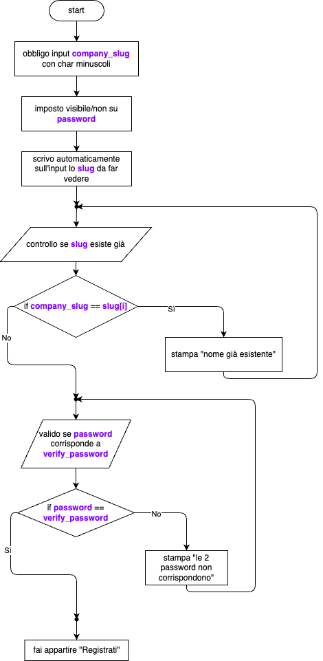
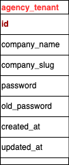

# ARCHITETTURA LinkBayCMS v0.1.0

## indice

## Landing
Iniziamo dalle pagine normali visibili sui motori di ricerca del CMS

## Registrazione - tenant_agency
Questa è la parte fondamentale dove si andranno a registrare le agenzie/softwarehouse

L'agency/software house può registrarsi su https://www.linkbay-cms.com/register

### Flowchart Frontend

### Flowchart Backend

## Login - tenant_agency
Una volta registrate avranno accesso al loro tenant personalizzato inviato via email. 
Ogni agenzia/softwarehouse ha il proprio tenant, esempio su "Agenzia Alfa":
    1) Agenzia Alfa si registra su https://www.linkbay-cms.com/register;
    2) Il software "crea" aggiunge sul DB PostgreSQL globale i dati dell'agenzia come tenant;
    3) viene inviata una email con un link personalizzato per l'accesso: https://agenzia_alfa.linkbay-cms.com/login;
    4) L'agenzia accede al portale con le proprie credenziali come utente ROLE==superadmin;
    5) Grazie al multitenant c'è un filtro che garantisce isolamento dati e una esperienza da personalizzare.

## Dashboard - tenant_agency
Una volta entrati come superadmin qui entra in gioco la super-personalizzazione del loro "WorkSapce" e l'aggiunta del team:
    1) il cliente può creare il proprio team che riceverà per email l'invito ad accedere sulla piattaforma https://agenzia_alfa.linkbay-cms.com/register_team, personalizzando il ruolo (es. ROLE==Developer o ROLE==Designer);
    2) una volta registrato l'utente accederà alla dashboard e potrà lavorare nel limite dei permessi stabiliti dal Superadmin;
    3) tornando a superadmin, potrà personalizzare il workspace con il proprio logo, i propri colori e la propria disposizione degli elementi;
    4) avrà accesso ad un gestionale interno per scadenziari lavori e assegnazione degli stessi.

