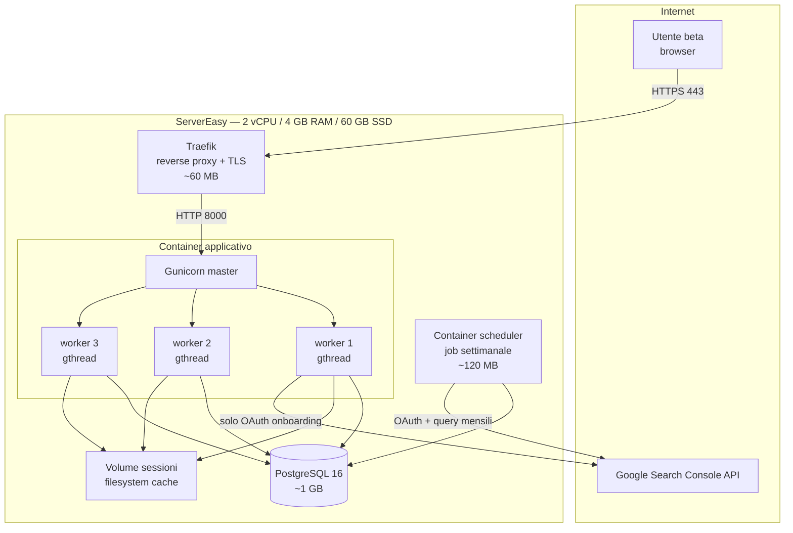
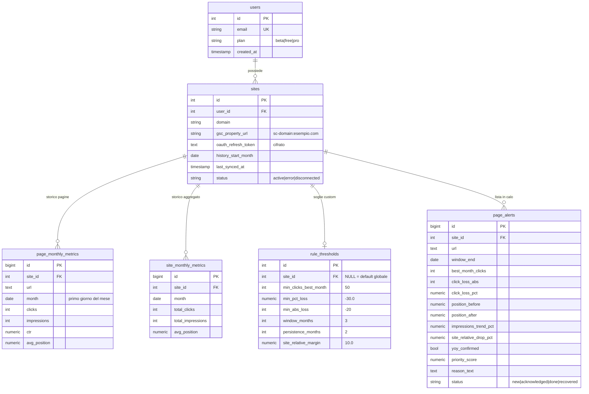
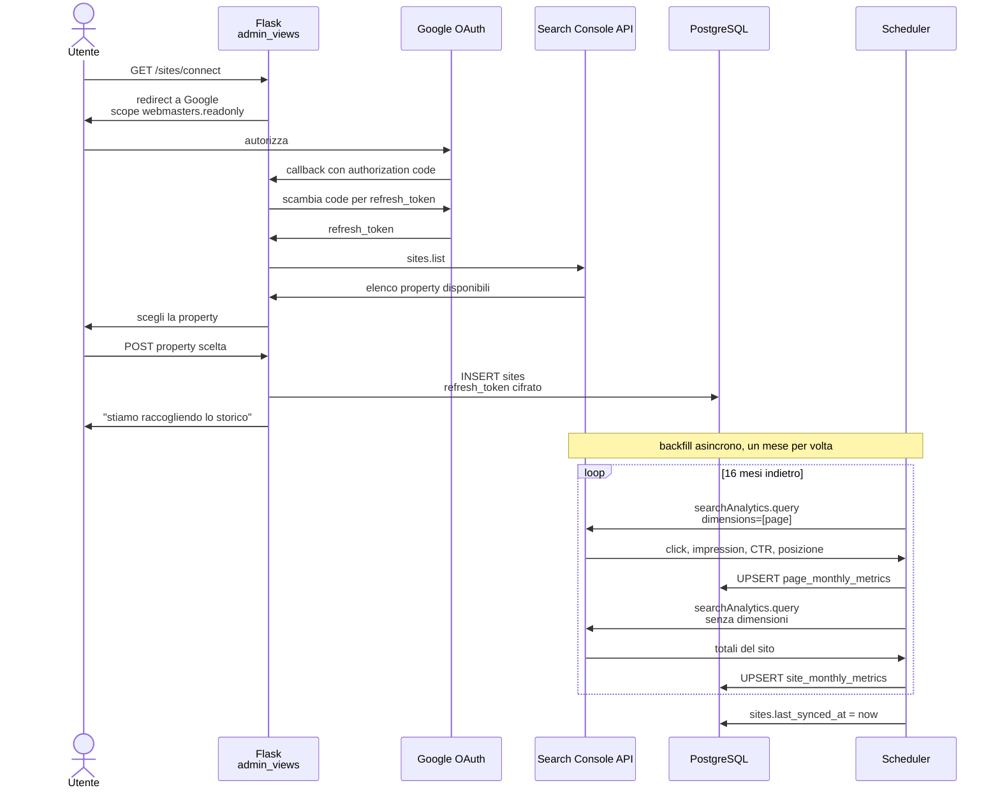
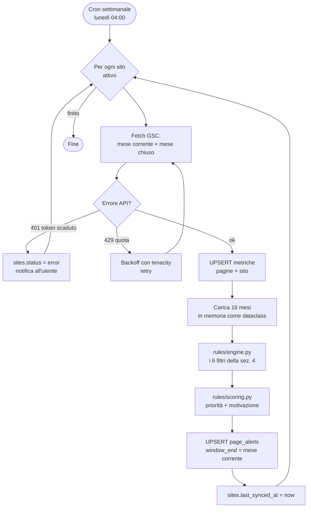
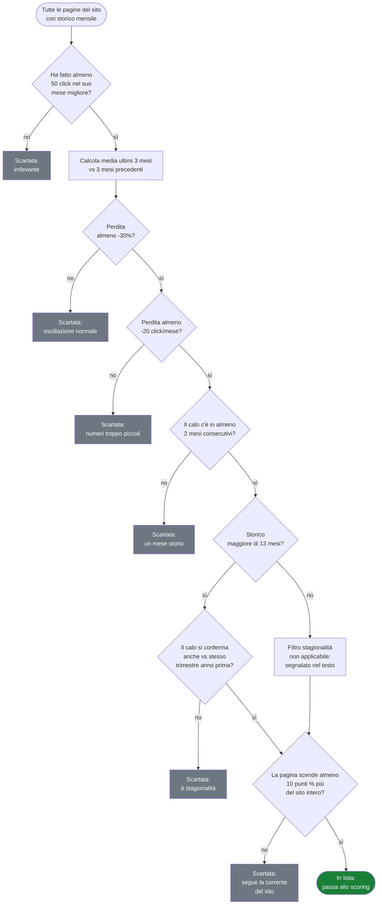
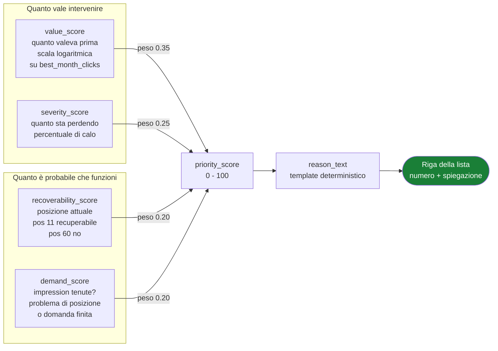
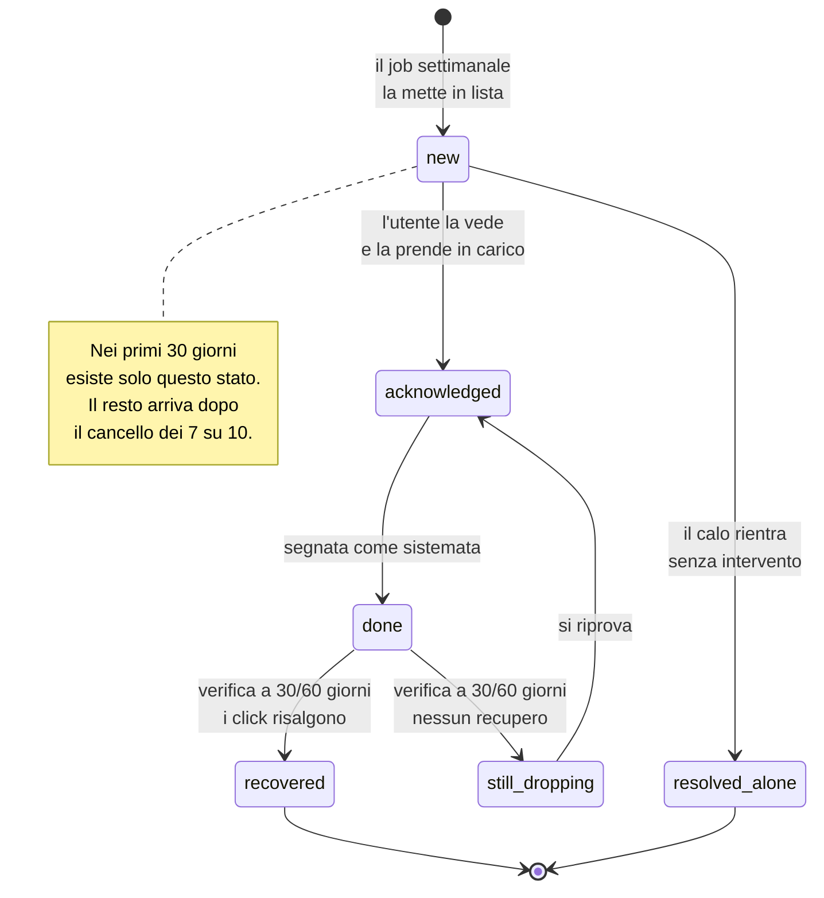
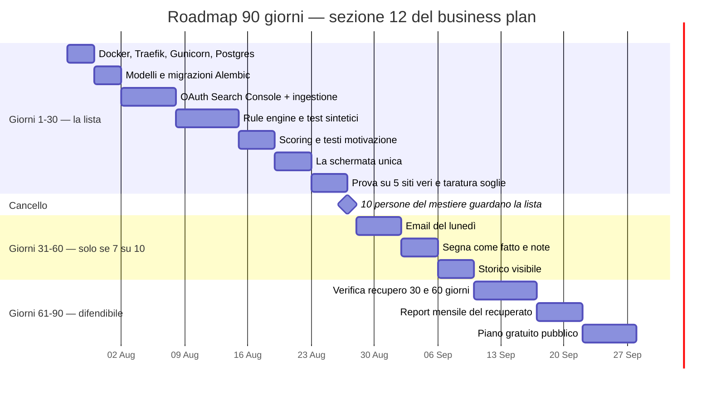

# LinkBay CMS — Architettura tecnica dell'MVP

**Prodotto:** il monitor delle pagine che perdono traffico organico.
**Riferimento funzionale:** `BUSINESS_PLAN.md`, sezioni 4, 5, 12, 13.
**Obiettivo dei 30 giorni:** una sola schermata — Search Console → storico → regole → lista ordinata.

Stack confermato: **Flask 3.1.3 + SQLAlchemy 2.0 + Jinja2**, deploy su ServerEasy (2 vCPU / 4 GB RAM / 60 GB SSD) con Docker, Traefik e un server WSGI multi-worker.

---

## 1. Vincoli che guidano ogni scelta

| Vincolo | Conseguenza architetturale |
|---|---|
| Un solo sviluppatore, nessun team | Niente microservizi, niente coda di messaggi, niente servizi aggiuntivi da mantenere. Un'app, un DB, uno scheduler. |
| 2 vCPU / 4 GB RAM | Ogni container ha un budget di memoria dichiarato. Niente pandas (200+ MB per processo), niente Elasticsearch, niente Celery+Redis+Flower. |
| Lo storico non si butta mai (sez. 13) | I dati mensili sono il patrimonio del prodotto, non una cache. Backup del volume Postgres dal primo giorno. |
| Le soglie sono tarabili (sez. 4) | Nessuna soglia hardcoded: vivono su tabella, con default globale e override per sito. |
| Il rule engine è il prodotto | Modulo Python puro, isolato da Flask e dal DB, testabile con dati sintetici. |
| Più utenti in contemporanea | Server WSGI con worker multipli, sessioni condivise tra worker, scheduler in un processo separato. |

---

## 2. Architettura di deploy


```mermaid
graph TB
    subgraph internet["Internet"]
        U["Utente beta<br/>browser"]
        GSC["Google Search Console API"]
    end

    subgraph server["ServerEasy — 2 vCPU / 4 GB RAM / 60 GB SSD"]
        TR["Traefik<br/>reverse proxy + TLS<br/>~60 MB"]

        subgraph app_layer["Container applicativo"]
            GU["Gunicorn master"]
            W1["worker 1<br/>gthread"]
            W2["worker 2<br/>gthread"]
            W3["worker 3<br/>gthread"]
        end

        SCH["Container scheduler<br/>job settimanale<br/>~120 MB"]
        PG[("PostgreSQL 16<br/>~1 GB")]
        VOL["Volume sessioni<br/>filesystem cache"]
    end

    U -->|"HTTPS 443"| TR
    TR -->|"HTTP 8000"| GU
    GU --> W1
    GU --> W2
    GU --> W3
    W1 --> PG
    W2 --> PG
    W3 --> PG
    W1 --> VOL
    W2 --> VOL
    W3 --> VOL
    SCH --> PG
    SCH -->|"OAuth + query mensili"| GSC
    W1 -->|"solo OAuth onboarding"| GSC
```

**Punto critico:** lo scheduler gira in un **container separato**, non dentro Gunicorn. Se lo mettessi dentro l'app con 3 worker, il job settimanale partirebbe 3 volte in parallelo sugli stessi siti, con conseguente doppio consumo di quota API e righe duplicate. È l'errore più comune in questo tipo di architettura, e il modo più semplice per evitarlo è separare i processi.

### Budget di memoria dichiarato

| Container | Limite | Note |
|---|---|---|
| `traefik` | 128 MB | routing + certificati Let's Encrypt |
| `web` (Gunicorn, 3 worker gthread) | 1,2 GB | ~350 MB per worker con SQLAlchemy caricato |
| `scheduler` | 512 MB | picco durante l'elaborazione di un sito |
| `postgres` | 1,5 GB | `shared_buffers = 384MB`, `work_mem = 16MB` |
| margine di sistema | ~600 MB | OS, Docker daemon, log |

Totale allocato ≈ 3,4 GB su 4 GB: resta margine per i picchi senza rischiare l'OOM killer.

---

## 3. Configurazione WSGI per l'accesso concorrente

Con 2 vCPU la formula classica `(2 × core) + 1 = 5` worker sync sarebbe sbagliata qui: il carico dell'app non è CPU-bound, è **I/O-bound** — attesa del database e, in fase di onboarding, attesa delle risposte di Google. Quindi meglio pochi worker con thread:

```python
# gunicorn.conf.py
bind = "0.0.0.0:8000"
workers = 3                    # 2 vCPU: 3 worker evitano thrashing
worker_class = "gthread"       # I/O-bound: thread meglio di processi
threads = 4                    # 3 x 4 = 12 richieste concorrenti
worker_connections = 100
timeout = 60                   # l'onboarding OAuth può essere lento
graceful_timeout = 30
keepalive = 5
max_requests = 1000            # ricicla i worker: previene leak lenti
max_requests_jitter = 100
preload_app = True             # condivide memoria tra worker via fork
accesslog = "-"
errorlog = "-"
loglevel = "info"
```

**Capacità risultante:** ~12 richieste realmente concorrenti. Per 10-20 utenti beta che consultano una lista una volta a settimana è sovradimensionato — ed è giusto che lo sia: non voglio pensare alla capacità durante la beta.

**Conseguenza su `preload_app = True`:** l'engine SQLAlchemy va creato **dopo** il fork, non prima, altrimenti i worker si passano connessioni condivise e si rompono in modo difficile da diagnosticare:

```python
# app/extensions.py
from sqlalchemy import create_engine

engine = create_engine(
    DATABASE_URL,
    pool_size=5,           # per worker
    max_overflow=2,
    pool_pre_ping=True,    # rileva connessioni morte
    pool_recycle=1800,
)
```

Con 3 worker × 7 connessioni max = 21 connessioni, più lo scheduler: `max_connections = 50` su Postgres è sufficiente e prudente.

**Sessioni:** `Flask-Session` con `cachelib.FileSystemCache` su un volume condiviso tra i worker. La sessione in-memory di default si romperebbe con 3 worker (l'utente verrebbe disconnesso a caso a ogni richiesta servita da un worker diverso). Redis non serve a questa scala.

---

## 4. Struttura del progetto

Sviluppo dello scaffolding attuale, senza cambiarne l'impostazione:

```
LinkBay-CMS/
├── app.py                        # entrypoint: crea l'app, registra i blueprint
├── gunicorn.conf.py
├── requirements.txt
├── .env.example                  # mai .env nel repo
├── .gitignore
├── docker-compose.yml
├── Dockerfile
├── BUSINESS_PLAN.md
├── README.md · CONTRIBUTING.md · LICENSE
│
├── app/
│   ├── __init__.py               # create_app(): factory
│   ├── config.py                 # config da variabili d'ambiente
│   ├── extensions.py             # db, login_manager, session, csrf
│   │
│   ├── models/                   # ── SQLAlchemy 2.0, mapped_column
│   │   ├── user.py
│   │   ├── site.py
│   │   ├── metrics.py            # page_monthly_metrics, site_monthly_metrics
│   │   ├── thresholds.py
│   │   └── alert.py              # page_alerts
│   │
│   ├── auth/                     # ── login magic-link, Flask-Login
│   │   ├── routes.py
│   │   ├── forms.py              # WTForms
│   │   └── tokens.py             # itsdangerous: token firmati a scadenza
│   │
│   ├── landing/                  # ── pagine pubbliche, lista d'attesa
│   │   └── routes.py
│   │
│   ├── admin_views/              # ── LA schermata unica del prodotto
│   │   ├── routes.py             # GET /dashboard, GET /sites/<id>
│   │   └── gsc_oauth.py          # connessione Search Console
│   │
│   ├── services/                 # ── NUOVO: logica non-web
│   │   ├── gsc_client.py         # chiamate alla Search Console API
│   │   ├── ingestion.py          # GSC → page_monthly_metrics
│   │   └── alerts.py             # orchestra rules/ e scrive page_alerts
│   │
│   ├── rules/                    # ── NUOVO: il cuore del prodotto
│   │   ├── engine.py             # applica i filtri in sequenza
│   │   ├── filters.py            # una funzione per ogni riga della sez. 4
│   │   ├── scoring.py            # sez. 5: punteggio + testo motivazione
│   │   ├── thresholds.py         # lettura soglie: default o per sito
│   │   └── types.py              # dataclass PageSeries, AlertCandidate
│   │
│   ├── templates/
│   │   ├── base.html
│   │   ├── auth/ · landing/
│   │   └── admin/
│   │       ├── dashboard.html
│   │       └── _alert_row.html   # frammento riutilizzabile
│   │
│   └── cli.py                    # comandi: flask ingest, flask run-rules
│
├── scheduler/
│   └── weekly.py                 # loop del job settimanale
│
├── tests/
│   ├── fixtures.py               # serie sintetiche: i 5 casi limite
│   ├── test_filters.py
│   ├── test_scoring.py
│   └── test_ingestion.py
│
├── migrations/                   # Alembic via Flask-Migrate
└── static/
    └── css/
```

`services/` e `rules/` sono le uniche due cartelle nuove rispetto a oggi, e la separazione è deliberata: `rules/` non importa **nulla** di Flask e nulla di SQLAlchemy. Riceve dataclass, restituisce dataclass. È l'unico modo per poterlo testare seriamente e per tarare le soglie senza avviare l'applicazione.

---

## 5. Dipendenze da aggiungere

Il `requirements.txt` attuale copre il livello web ma non ancora ingestione, DB driver e produzione:

```txt
# ── già presenti ──────────────────────────────
blinker==1.9.0
cachelib==0.14.0
click==8.4.2
Flask==3.1.3
Flask-Login==0.6.3
Flask-Session==0.8.0
Flask-SQLAlchemy==3.1.1
Flask-WTF==1.3.0
itsdangerous==2.2.0
Jinja2==3.1.6
MarkupSafe==3.0.3
msgspec==0.21.1
SQLAlchemy==2.0.51
typing_extensions==4.16.0
Werkzeug==3.1.8
WTForms==3.2.2

# ── da aggiungere ─────────────────────────────
psycopg[binary]==3.2.*          # driver PostgreSQL, versione 3
Flask-Migrate==4.*              # Alembic: la cartella migrations/ esiste già
gunicorn==23.*                  # server WSGI di produzione
python-dotenv==1.*              # caricamento .env in sviluppo
google-auth-oauthlib==1.*       # flusso OAuth 2.0 verso Google
google-api-python-client==2.*   # client Search Console
APScheduler==3.*                # scheduling nel container dedicato
tenacity==9.*                   # retry con backoff sulle chiamate API
```

**Niente pandas, deliberatamente.** Le regole della sezione 4 lavorano su serie di 16 valori mensili per pagina: sono medie, rapporti e confronti che in Python puro si scrivono in modo più leggibile, più testabile e con un consumo di memoria trascurabile. Su 4 GB di RAM, importare pandas in ogni worker sarebbe un costo senza ritorno.

---

## 6. Modello dati


```mermaid
erDiagram
    users ||--o{ sites : "possiede"
    sites ||--o{ page_monthly_metrics : "storico pagine"
    sites ||--o{ site_monthly_metrics : "storico aggregato"
    sites ||--o| rule_thresholds : "soglie custom"
    sites ||--o{ page_alerts : "lista in calo"

    users {
        int id PK
        string email UK
        string plan "beta|free|pro"
        timestamp created_at
    }

    sites {
        int id PK
        int user_id FK
        string domain
        string gsc_property_url "sc-domain:esempio.com"
        text oauth_refresh_token "cifrato"
        date history_start_month
        timestamp last_synced_at
        string status "active|error|disconnected"
    }

    page_monthly_metrics {
        bigint id PK
        int site_id FK
        text url
        date month "primo giorno del mese"
        int clicks
        int impressions
        numeric ctr
        numeric avg_position
    }

    site_monthly_metrics {
        bigint id PK
        int site_id FK
        date month
        int total_clicks
        int total_impressions
        numeric avg_position
    }

    rule_thresholds {
        int id PK
        int site_id FK "NULL = default globale"
        int min_clicks_best_month "50"
        numeric min_pct_loss "-30.0"
        int min_abs_loss "-20"
        int window_months "3"
        int persistence_months "2"
        numeric site_relative_margin "10.0"
    }

    page_alerts {
        bigint id PK
        int site_id FK
        text url
        date window_end
        int best_month_clicks
        int click_loss_abs
        numeric click_loss_pct
        numeric position_before
        numeric position_after
        numeric impressions_trend_pct
        numeric site_relative_drop_pct
        bool yoy_confirmed
        numeric priority_score
        text reason_text
        string status "new|acknowledged|done|recovered"
    }
```

### Dimensionamento su 60 GB SSD

Caso peggiore del target dichiarato in sezione 8 — 20 siti da 20.000 pagine:

```
20 siti × 20.000 pagine × 16 mesi     = 6.400.000 righe
6.400.000 × ~120 byte per riga        ≈ 770 MB
+ indici su (site_id, url, month)     ≈ 400 MB
+ crescita di 1 mese/anno per sito    ≈ 48 MB/mese
```

Circa **1,2 GB per il primo anno completo**, meno di 600 MB di crescita annua. I 60 GB sono abbondanti anche tenendo backup giornalieri compressi con `pg_dump` e ritenzione a 30 giorni. Il vero limite del server sarà la RAM, non il disco.

### Indici indispensabili

```sql
CREATE UNIQUE INDEX ix_pmm_site_url_month
  ON page_monthly_metrics (site_id, url, month);

CREATE INDEX ix_pmm_site_month
  ON page_monthly_metrics (site_id, month DESC);

CREATE UNIQUE INDEX ix_smm_site_month
  ON site_monthly_metrics (site_id, month);

CREATE INDEX ix_alerts_site_window_priority
  ON page_alerts (site_id, window_end DESC, priority_score DESC);
```

L'ultimo indice serve la query principale della schermata unica: "dammi gli alert di questo sito per l'ultimo periodo, ordinati per priorità". Senza, diventa un sequential scan appena la tabella cresce.

---

## 7. Onboarding: connessione a Search Console


```mermaid
sequenceDiagram
    actor U as Utente
    participant F as Flask<br/>admin_views
    participant G as Google OAuth
    participant API as Search Console API
    participant DB as PostgreSQL
    participant S as Scheduler

    U->>F: GET /sites/connect
    F->>U: redirect a Google<br/>scope webmasters.readonly
    U->>G: autorizza
    G->>F: callback con authorization code
    F->>G: scambia code per refresh_token
    G->>F: refresh_token
    F->>API: sites.list
    API->>F: elenco property disponibili
    F->>U: scegli la property
    U->>F: POST property scelta
    F->>DB: INSERT sites<br/>refresh_token cifrato
    F->>U: "stiamo raccogliendo lo storico"

    Note over S,API: backfill asincrono, un mese per volta
    loop 16 mesi indietro
        S->>API: searchAnalytics.query<br/>dimensions=[page]
        API->>S: click, impression, CTR, posizione
        S->>DB: UPSERT page_monthly_metrics
        S->>API: searchAnalytics.query<br/>senza dimensioni
        API->>S: totali del sito
        S->>DB: UPSERT site_monthly_metrics
    end
    S->>DB: sites.last_synced_at = now
```

**Perché una query per mese e non per giorno.** La documentazione ufficiale di Google ([Usage Limits — Search Console API](https://developers.google.com/webmaster-tools/limits)) chiarisce due cose: le query raggruppate o filtrate per `page` sono le più costose, e il costo cresce con l'ampiezza dell'intervallo di date. Scaricare dati giornalieri per 3.000 pagine × 480 giorni significherebbe milioni di righe da paginare e aggregare in app, con un consumo di RAM che 4 GB non regge. Interrogando invece un mese per volta con `dimensions=['page']`, Google restituisce già click, impression, CTR e posizione media aggregati per quel mese, in un'unica chiamata da massimo 25.000 righe.

Le quote non sono un problema a questa scala: 1.200 query al minuto per sito e per utente, 40.000 al minuto per progetto. Il backfill di un sito sono 32 chiamate in totale.

Un'unica accortezza: la stessa pagina cita esplicitamente di evitare di richiedere ripetutamente gli stessi dati. Per questo il job settimanale rinfresca **solo** il mese corrente e quello appena chiuso — i dati di Search Console arrivano con 2-3 giorni di ritardo e vengono corretti retroattivamente — mentre i mesi più vecchi si considerano definitivi e non si toccano più.

---

## 8. Il job settimanale


```mermaid
flowchart TD
    START(["Cron settimanale<br/>lunedì 04:00"]) --> LOOP{"Per ogni sito<br/>attivo"}
    LOOP --> FETCH["Fetch GSC:<br/>mese corrente + mese chiuso"]
    FETCH --> ERR{"Errore API?"}
    ERR -->|"401 token scaduto"| MARK["sites.status = error<br/>notifica all'utente"]
    ERR -->|"429 quota"| WAIT["Backoff con tenacity<br/>retry"]
    WAIT --> FETCH
    ERR -->|"ok"| UP["UPSERT metriche<br/>pagine + sito"]
    UP --> LOAD["Carica 16 mesi<br/>in memoria come dataclass"]
    LOAD --> RULES["rules/engine.py<br/>i 6 filtri della sez. 4"]
    RULES --> SCORE["rules/scoring.py<br/>priorità + motivazione"]
    SCORE --> SAVE["UPSERT page_alerts<br/>window_end = mese corrente"]
    SAVE --> SYNC["sites.last_synced_at = now"]
    SYNC --> LOOP
    MARK --> LOOP
    LOOP -->|"finito"| END(["Fine"])
```

Elaborazione **sequenziale**, un sito per volta. Con 20 siti da 20.000 pagine il job impiega qualche minuto e usa un solo core, lasciando l'altro libero per servire le richieste web. Nessun parallelismo finché il numero di siti non lo giustifica davvero — e a quel punto la soluzione sarà un secondo container scheduler, non una coda.

Il job è **idempotente**: gli `UPSERT` su `(site_id, url, month)` e `(site_id, url, window_end)` fanno sì che rieseguirlo non duplichi nulla. Questo lo rende sicuro da rilanciare a mano dopo un errore, che è l'unico piano di recupero che voglio mantenere durante la beta.

---

## 9. Il rule engine — i filtri della sezione 4


```mermaid
flowchart TD
    IN(["Tutte le pagine del sito<br/>con storico mensile"]) --> F1{"Ha fatto almeno<br/>50 click nel suo<br/>mese migliore?"}
    F1 -->|no| OUT1["Scartata:<br/>irrilevante"]
    F1 -->|sì| CALC["Calcola media ultimi 3 mesi<br/>vs 3 mesi precedenti"]

    CALC --> F2{"Perdita<br/>almeno -30%?"}
    F2 -->|no| OUT2["Scartata:<br/>oscillazione normale"]
    F2 -->|sì| F3{"Perdita almeno<br/>-20 click/mese?"}

    F3 -->|no| OUT3["Scartata:<br/>numeri troppo piccoli"]
    F3 -->|sì| F4{"Il calo c'è in almeno<br/>2 mesi consecutivi?"}

    F4 -->|no| OUT4["Scartata:<br/>un mese storto"]
    F4 -->|sì| F5{"Storico<br/>maggiore di 13 mesi?"}

    F5 -->|no| SKIP["Filtro stagionalità<br/>non applicabile:<br/>segnalato nel testo"]
    F5 -->|sì| F5B{"Il calo si conferma<br/>anche vs stesso<br/>trimestre anno prima?"}

    F5B -->|no| OUT5["Scartata:<br/>è stagionalità"]
    F5B -->|sì| F6
    SKIP --> F6

    F6{"La pagina scende almeno<br/>10 punti % più<br/>del sito intero?"}
    F6 -->|no| OUT6["Scartata:<br/>segue la corrente<br/>del sito"]
    F6 -->|sì| PASS(["In lista:<br/>passa allo scoring"])

    style PASS fill:#1a7f37,color:#fff
    style OUT1 fill:#6e7781,color:#fff
    style OUT2 fill:#6e7781,color:#fff
    style OUT3 fill:#6e7781,color:#fff
    style OUT4 fill:#6e7781,color:#fff
    style OUT5 fill:#6e7781,color:#fff
    style OUT6 fill:#6e7781,color:#fff
```

Il filtro 6 è quello che il business plan indica come vero motivo per cui la lista è utile — elimina il 90% del rumore e risponde alla domanda che ogni SEO fa entro due minuti di demo. Vale la pena notare che è anche il filtro che richiede `site_monthly_metrics`: è la ragione per cui quella tabella esiste, e per cui ogni ingestione fa due chiamate API invece di una.

Ogni filtro è una funzione pura con la stessa firma, così l'ordine è configurabile e ognuno è testabile in isolamento:

```python
# app/rules/filters.py
def passes_relevance(series: PageSeries, t: Thresholds) -> FilterResult:
    """Sez. 4: soglia minima di rilevanza."""
    best = max(series.monthly_clicks)
    ok = best >= t.min_clicks_best_month
    return FilterResult(
        passed=ok,
        reason=None if ok else f"mese migliore solo {best} click",
        data={"best_month_clicks": best},
    )
```

Il campo `reason` sui filtri **falliti** non finisce nella lista dell'utente, ma è indispensabile per il lavoro di taratura previsto in sezione 15: quando controllerai a mano le prime 20 righe su 5 siti veri, la domanda utile non sarà solo "perché c'è questa pagina" ma "perché **manca** quella che so essere in calo". Senza tracciare il motivo di scarto, quella domanda non ha risposta e la taratura diventa indovinare.

---

## 10. Punteggio di priorità — sezione 5


```mermaid
flowchart LR
    subgraph valore["Quanto vale intervenire"]
        V["value_score<br/>quanto valeva prima<br/>scala logaritmica<br/>su best_month_clicks"]
        S["severity_score<br/>quanto sta perdendo<br/>percentuale di calo"]
    end

    subgraph prob["Quanto è probabile che funzioni"]
        R["recoverability_score<br/>posizione attuale<br/>pos 11 recuperabile<br/>pos 60 no"]
        D["demand_score<br/>impression tenute?<br/>problema di posizione<br/>o domanda finita"]
    end

    V -->|"peso 0.35"| P
    S -->|"peso 0.25"| P
    R -->|"peso 0.20"| P
    D -->|"peso 0.20"| P

    P["priority_score<br/>0 - 100"] --> T["reason_text<br/>template deterministico"]
    T --> LIST(["Riga della lista<br/>numero + spiegazione"])

    style LIST fill:#1a7f37,color:#fff
```

```python
priority_score = (
    value_score          * 0.35
    + severity_score     * 0.25
    + recoverability_score * 0.20
    + demand_score       * 0.20
)
```

Pesi di partenza, non verità — come le soglie, vanno tarati sui 5 siti reali della checklist dei 30 giorni.

**Il testo della motivazione è generato da un template deterministico, mai da un modello linguistico.** La sezione 6 del piano dice che la credibilità della lista è l'unico patrimonio del prodotto, e che il giorno in cui un cliente scopre un numero sbagliato non crede più a niente. Un testo generativo introduce esattamente quel rischio senza portare alcun vantaggio: la frase da scrivere è sempre la stessa struttura con numeri diversi, e Jinja2 la produce già in modo riproducibile e verificabile riga per riga.

```
Ha perso {{ loss_abs }} click/mese negli ultimi {{ months }} mesi.
Era in posizione media {{ pos_before }}, ora è {{ pos_after }}.
Il resto del sito nello stesso periodo è {{ site_trend_phrase }}:
questa pagina sta scendendo per conto suo.
{{ demand_phrase }}
Priorità {{ priority_label }}: {{ priority_rationale }}.
```

---

## 11. Ciclo di vita di un alert


```mermaid
stateDiagram-v2
    [*] --> new: il job settimanale<br/>la mette in lista
    new --> acknowledged: l'utente la vede<br/>e la prende in carico
    acknowledged --> done: segnata come sistemata
    done --> recovered: verifica a 30/60 giorni<br/>i click risalgono
    done --> still_dropping: verifica a 30/60 giorni<br/>nessun recupero
    new --> resolved_alone: il calo rientra<br/>senza intervento
    still_dropping --> acknowledged: si riprova
    recovered --> [*]
    resolved_alone --> [*]

    note right of new
        Nei primi 30 giorni
        esiste solo questo stato.
        Il resto arriva dopo
        il cancello dei 7 su 10.
    end note
```

Gli stati oltre `new` sono progettati adesso ma **implementati dopo**: servono a non dover migrare il modello dati quando arriveranno, ma non giustificano una riga di UI nei primi 30 giorni. Lo stato `recovered` è quello che alimenterà la metrica più importante della sezione 14 — quante pagine indicate per prime risalgono davvero.

---

## 12. Ordine di costruzione


```mermaid
gantt
    title Roadmap 90 giorni — sezione 12 del business plan
    dateFormat YYYY-MM-DD
    axisFormat %d %b

    section Giorni 1-30 — la lista
    Docker, Traefik, Gunicorn, Postgres    :2026-07-27, 3d
    Modelli e migrazioni Alembic           :2026-07-30, 3d
    OAuth Search Console + ingestione      :2026-08-02, 6d
    Rule engine e test sintetici           :2026-08-08, 7d
    Scoring e testi motivazione            :2026-08-15, 4d
    La schermata unica                     :2026-08-19, 4d
    Prova su 5 siti veri e taratura soglie :2026-08-23, 4d

    section Cancello
    10 persone del mestiere guardano la lista :milestone, 2026-08-27, 0d

    section Giorni 31-60 — solo se 7 su 10
    Email del lunedì                       :2026-08-28, 5d
    Segna come fatto e note                :2026-09-02, 4d
    Storico visibile                       :2026-09-06, 4d

    section Giorni 61-90 — difendibile
    Verifica recupero 30 e 60 giorni       :2026-09-10, 7d
    Report mensile del recuperato          :2026-09-17, 5d
    Piano gratuito pubblico                :2026-09-22, 6d
```

**Il cancello del 27 agosto è la parte più importante di questo diagramma.** Non è una milestone tecnica: è la domanda "questa lista ti farebbe muovere lunedì mattina?" posta a dieci persone del mestiere. Se la risposta non arriva da almeno sette, quello che segue nel diagramma non va costruito — si tornano a tarare le soglie della sezione 4 e si torna dagli stessi dieci utenti. Il piano dice esplicitamente che ogni riga di codice scritta prima di saperlo è tempo buttato.

---

## 13. Cosa resta fuori dai 30 giorni

Per esplicita scelta della sezione 12 del piano, **non** entra nell'MVP:

- email del lunedì e qualsiasi notifica
- "segna come fatto", note, storico navigabile in UI
- verifica automatica del recupero
- piano gratuito pubblico e pagamenti
- valore in euro e integrazione Analytics
- mappa dei link interni e suggerimenti di linking
- multi-sito, white label, gestione team

Il multi-sito e il white label sono l'unica voce che vale la pena commentare: sono la porta d'ingresso al canale agenzie, che il piano colloca deliberatamente al mese sei. Lo schema dati sopra li rende già possibili — `sites.user_id` esiste dal primo giorno — ma l'interfaccia e i permessi restano fuori. È la differenza tra progettare per il futuro e costruire per il futuro.

---

## 14. I cinque test da scrivere prima di parlare con chiunque

Il piano, in sezione 15, chiede di controllare a mano le prime 20 righe su 5 siti veri. Prima ancora, servono cinque test con dati sintetici che coprono i casi limite dichiarati:

| Caso sintetico | Comportamento atteso |
|---|---|
| Pagina in calo vero e persistente, sito stabile | **entra** in lista, priorità alta |
| Pagina che oscilla sotto le soglie | **non entra** |
| Pagina stagionale — costumi da bagno a ottobre | **non entra**: il calo YoY non si conferma |
| Calo generale del sito dopo un update di Google | le pagine che seguono la media **non entrano**, solo quelle che scendono di più |
| Pagina già rientrata dopo un calo | **non entra**: persistenza rotta |

Sono i cinque casi che il business plan usa per giustificare i propri filtri. Averli come test automatici in `tests/fixtures.py` è il modo più rapido di scoprire che una soglia è sbagliata **prima** di mostrare la lista a un publisher vero — che è l'unico momento in cui un errore di taratura costa reputazione invece che dieci minuti.

---

## 15. Riepilogo delle decisioni

| Decisione | Alternativa scartata | Motivo |
|---|---|---|
| Flask 3.1 + Jinja2 server-rendered | SPA React/Next separata | Una schermata sola: una SPA sarebbe una build pipeline e un secondo deploy per zero valore aggiunto |
| Regole in Python puro | pandas | 16 valori per pagina: pandas costa 200 MB per worker su una macchina da 4 GB |
| Scheduler in container separato | APScheduler dentro Gunicorn | Con 3 worker il job partirebbe 3 volte |
| Gunicorn gthread, 3×4 | 5 worker sync | Carico I/O-bound, non CPU-bound |
| Sessioni su filesystem condiviso | Redis | Un servizio in meno da mantenere; Redis non serve a 20 utenti |
| Aggregazione mensile lato Google | dati giornalieri aggregati in app | Meno chiamate, meno RAM, quota rispettata |
| Testo motivazione da template | testo generato da LLM | La credibilità dei numeri è il patrimonio del prodotto — sez. 6 |
| Elaborazione sequenziale | parallela | 20 siti in pochi minuti: il parallelismo aggiunge solo modi di rompersi |

---

*Un tool che fa una cosa sola, la fa bene, e si finisce.*
